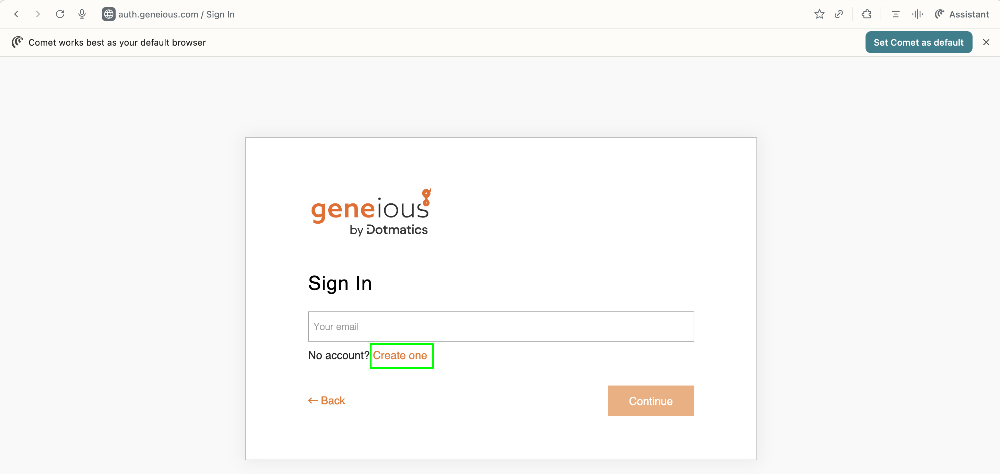
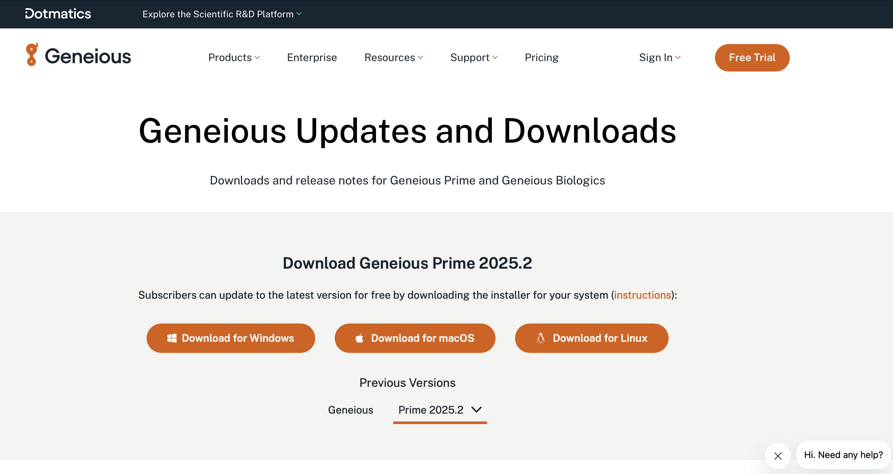
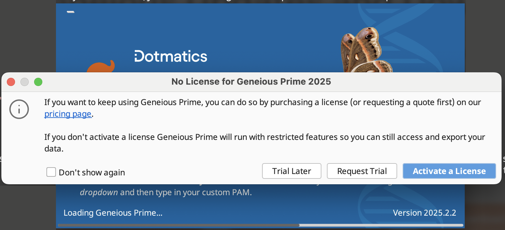
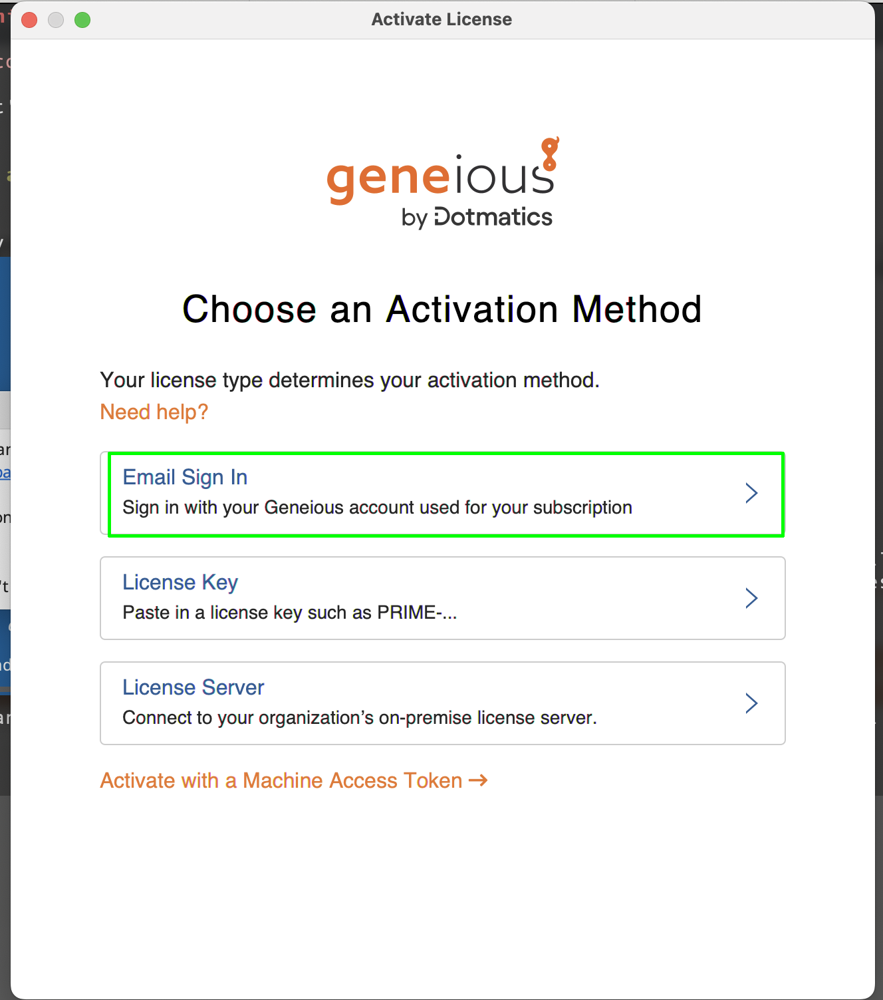

# Getting Geneious Enterprise up and running

1. Go to [Genious](https://www.geneious.com) to create an user account.
    - Click on `Sign in`
    - Click on `Geneious Prime My Account`

   

2. Create an account if you don't already have one (just following the simple instructions provided.

    

 

If you successfully created an account you should see the following screen.

    

 

You are ready to go.

3. Ideally, install the newest version of Geneious. Go to [Downloads](https://www.geneious.com/updates) and install the version of Geneious suitable for your operating system. The license will work with previous version of Geneious, but you may miss some of the new features.

    

 

4. Send and e-mail to Juan Jovel to get an invitation as license user. The license will be associated to the email you indicate and will be valid for two computers. After you accept the invitation, if you login in into your geneious account, you can see that a geneious license is available to you. You will see something like this:

    

 

5. Activate your license in Geneious.

Open the Geneious App. At some point you will see an box like the following:

    

 

Just click on `activate license`, You will see the following dialog box:

    

 

- Select `Email Sign in`.
- Provide your email and password (the same ones you use to sign in in the geneious webpage.

If succesful, you should see the following dialog box:

    

 

That's it. You are set, go and crack sequences, genomes, clones, etc.

    

 

